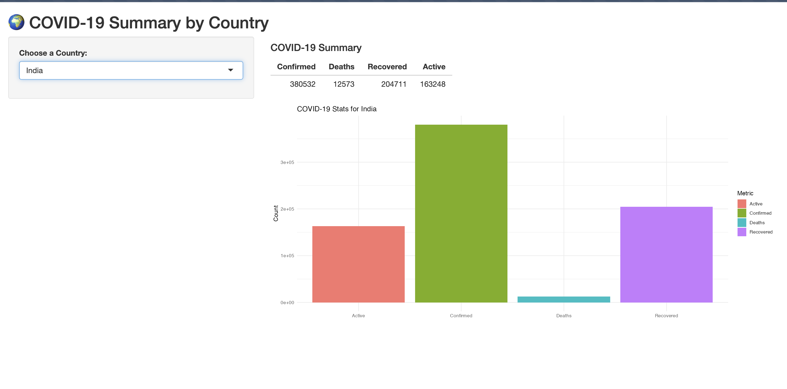

# 🌍 COVID-19 Dashboard (Shiny App)

This Shiny app provides an interactive summary of COVID-19 statistics by country using the `country_wise_latest.csv` dataset.

Users can:
- Select a country from a dropdown
- View Confirmed, Deaths, Recovered, and Active cases
- See a summary table and a dynamic bar chart

## 📸 Screenshot



---

## 📦 Requirements

- R (>= 4.0.0)
- R packages:
  - shiny
  - tidyverse

Install packages by running:

```r
install.packages(c("shiny", "tidyverse"))
